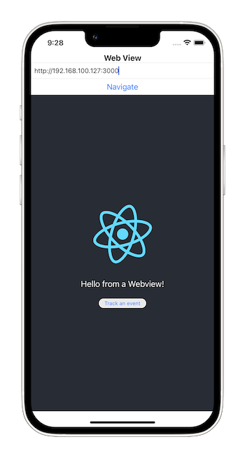

# Demo of WebView tracking in hybrid mobile apps

The demo shows a simple mobile app with an embedded Web view with Snowplow event tracking.
It consists of two parts:

1. Mobile app (iOS and Android projects provided)
2. ReactJS web app with the WebView tracker

## TODO: Add apps and add getting started docs
